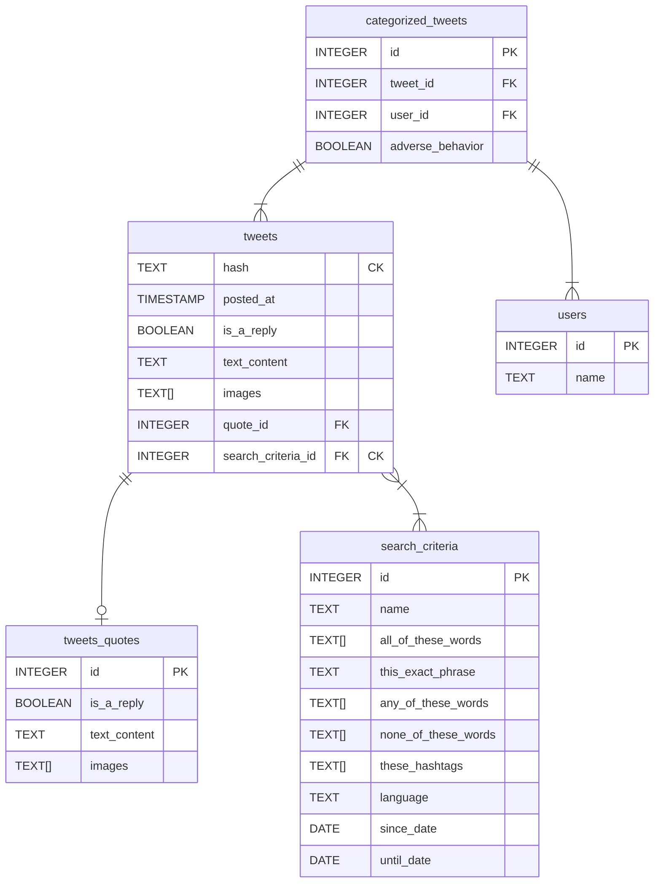

<p align="center">
  
</p>
<p align="center">Adverse Human Behaviors Corpus Creator<p>
<p align="center">
    
    
    
</p>

---


# AHBCC: Adverse Human Behaviors Corpus Creator

Adverse Human Behaviors is a term created to encompass all types of human behaviors that affect one or more individuals in physical, psychological, or emotional ways.

There are four main categories:
- Hate speech
- Depression and/or suicidal attempt
- Eating disorders
- Illicit drug use

## Application
This application serves as the orchestrator, utilizing a docker-compose.yml file to **connect the other two applications with the database managed by [AHBCC](https://github.com/lhbelfanti/ahbcc)**.

The primary objective is to gather information from X (formerly Twitter) using [GoXCrap](https://github.com/lhbelfanti/goxcrap). Subsequently, each tweet is manually evaluated to determine if it discusses an Adverse Human Behavior using [Binarizer](https://github.com/lhbelfanti/binarizer). Finally, [AHBCC](https://github.com/lhbelfanti/ahbcc) is in charge of creating a balanced corpus from the retrieved and categorized tweets.

### Endpoints

To allow [GoXCrap](https://github.com/lhbelfanti/goxcrap) to save the tweets into the database and then retrieve them using [Binarizer](https://github.com/lhbelfanti/binarizer), this application exposes different endpoints, encapsulating the access to the database in one place (this app).

### Database

Tables: **Entity Relationship Diagram**



#### Necessary files to start the database

To connect to the database we need to define a `.env` file in the root of the project. It should contain the following environment variables

```
DB_NAME=<Database name>
DB_USER=<Database username>
DB_PASS=<Database password>
```

Replace the `< ... >` by the correct value. For example: `DB_NAME=<Database name>` --> `DB_NAME=ahbcc`.
